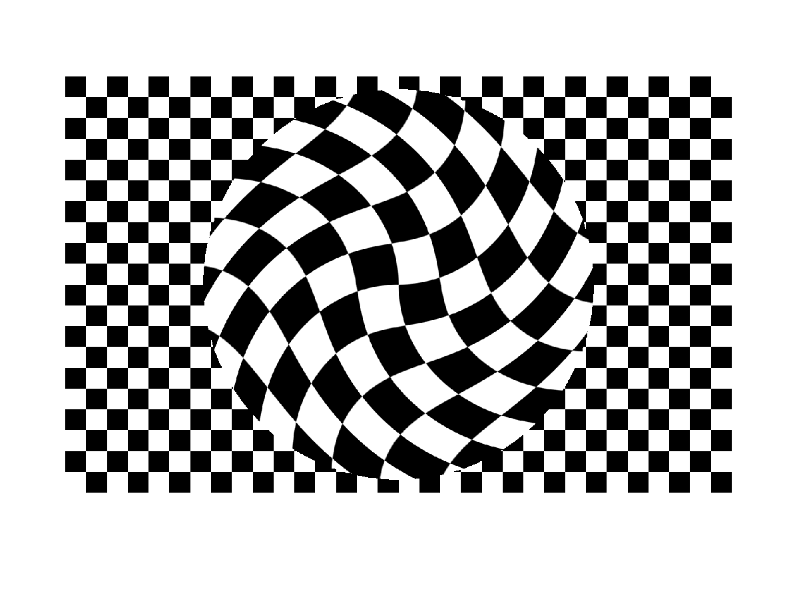
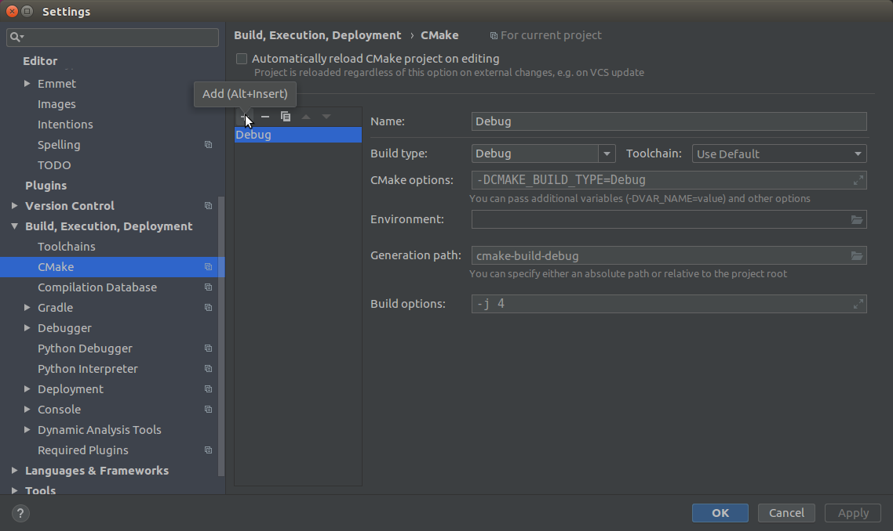
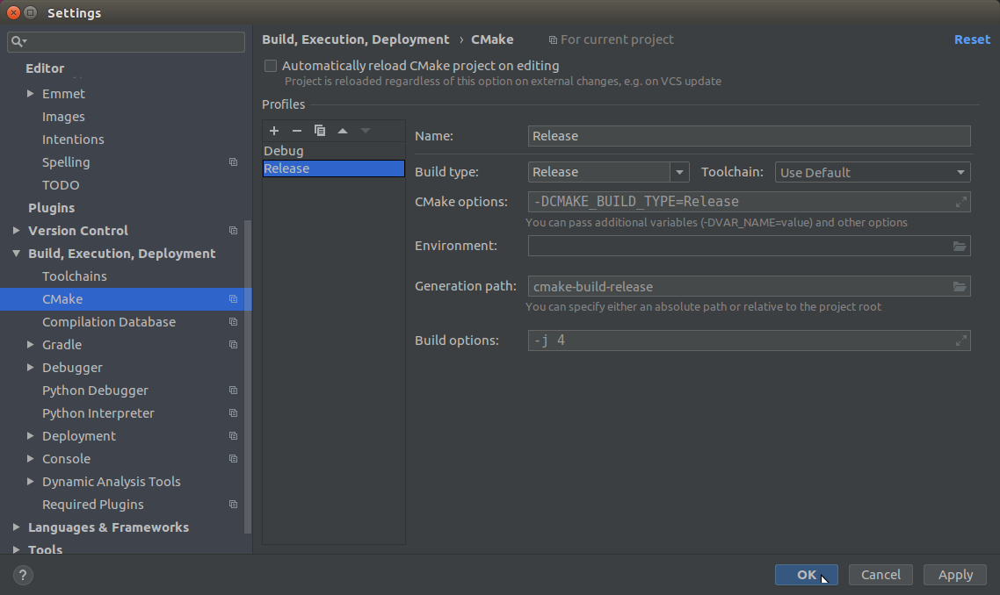
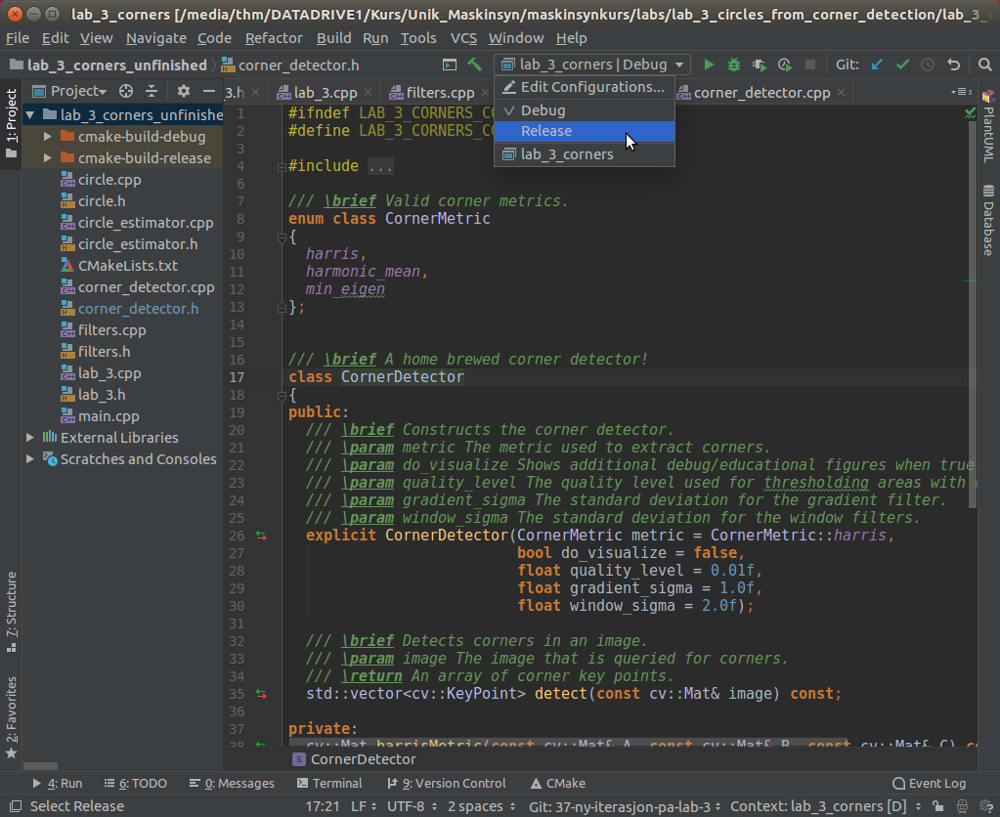

# Step 3: Detect circles from corners with RANSAC
It may seem like a bad idea to use corners to detect circles, but not when the scene looks like this:

To demonstrate the power of RANSAC, we will try to detect the circle above by finding the largest set of inlier points that lies on the circumference of a common circle.

## 8. Finish `CircleEstimator`
Take a look at the class declaration and documentation in [circle_estimator.h](https://github.com/tek5030/lab_03/blob/master/circle_estimator.h).

Now, read the code in `CircleEstimator::ransacEstimator` at [circle_estimator.cpp:31](https://github.com/tek5030/lab_03/blob/master/circle_estimator.cpp#L31).

The only thing you have to do to make this work is to remove the `break` and perform the correct test in the if-statement.
Do it!

## Compile and run with build type *Release*
You might find that the application is running really slowly now that we are trying to detect circles. 
One of the reasons is that Eigen by default runs a lot of assertions in debug mode. 
Another reason is that since Eigen is heavily templated, it benefits a lot from compiler optimizations, which by default is disabled in *debug mode* (see the [Eigen FAQ](http://eigen.tuxfamily.org/index.php?title=FAQ#How_do_I_get_good_performance.3F) for more information).

We will in this course use debug mode for developing and debugging (with assertions enabled), and *release mode* when running the application. 
Release mode disables assertions by default, and performs compiler optimizations.

To add the "Release build type" in CLion, first open the settings window (File -> Settings...).
Go to the "Build, Execution, Deployment" -> "CMake" panel. 
Press "+" to add a new "Profile":

The new profile is "Release" by default:

Press "OK".
Then switch to the "Release Profile" in CLion:

You are now ready to compile and run the application in release mode. 
You can also switch back to debug mode whenever you want.

Run the application in release mode, and see what happens!

## Play around with lab 3
Now, the code is finished!

It is now time to play:
- Point the camera towards the chessboard, and see if it is able to detect the circle.
- Play around with the RANSAC parameters, and the feature detection parameters.
  Can you make the detection more stable?
- Read through the estimator and try to relate the code to the example in the lecture.
